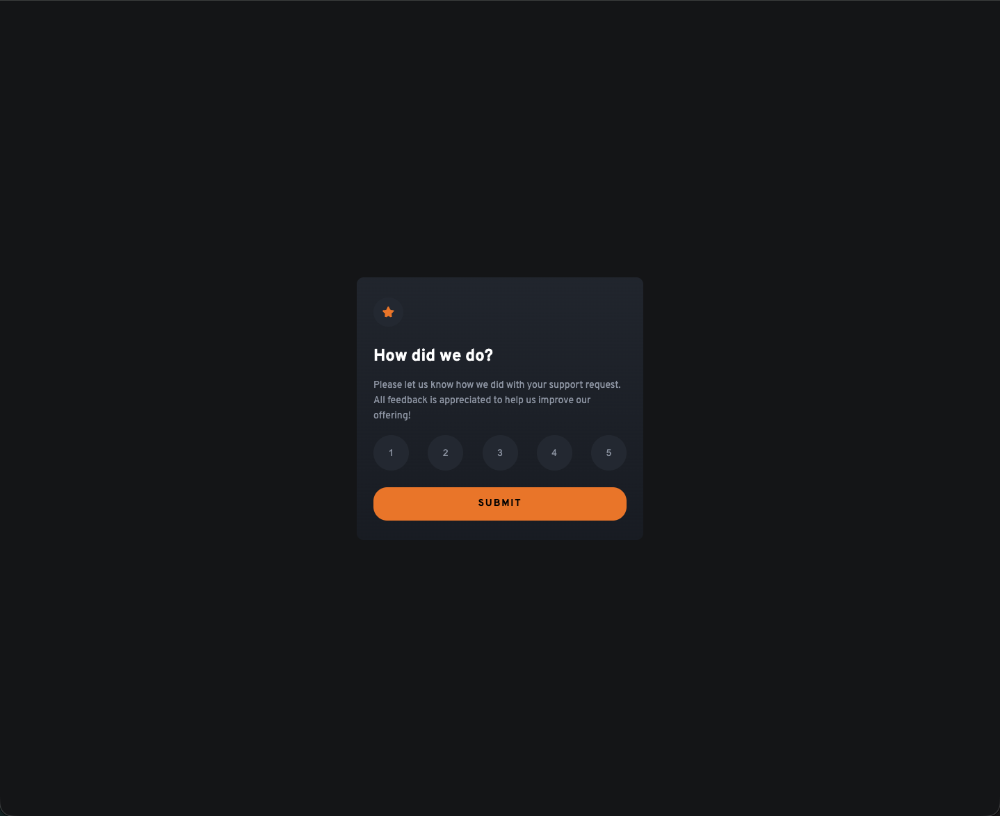

# Frontend Mentor - Interactive rating component solution

This is a solution to the [Interactive rating component challenge on Frontend Mentor](https://www.frontendmentor.io/challenges/interactive-rating-component-koxpeBUmI). Frontend Mentor challenges help you improve your coding skills by building realistic projects.

## Table of contents

- [Overview](#overview)
  - [The challenge](#the-challenge)
  - [Screenshot](#screenshot)
  - [Links](#links)
- [My process](#my-process)
  - [Built with](#built-with)
  - [What I learned](#what-i-learned)
  - [Continued development](#continued-development)
- [Author](#author)

## Overview

### The challenge

Users should be able to:

- View the optimal layout for the app depending on their device's screen size
- See hover states for all interactive elements on the page
- Select and submit a number rating
- See the "Thank you" card state after submitting a rating

### Screenshot

### Links

- Solution URL: [GitHub](https://github.com/tschaffroth/interactive-rating-component.git)
- Live Site URL: [Netlify](https://interactive-rating-component.netlify.app/)

## My process

### Built with

- Semantic HTML5 markup
- CSS custom properties
- JS
- Mobile-first workflow

### What I learned

This was my first project involving HTML/CSS and JS together. So writing layout, design and logic together was a new experience for me. Furthermore i learned to use clamp-values to grow the buttons with the rating score together with the screen size within certain limits. I did know clamp before but this was my first use-case in practice.

**Note: Delete this note and the content within this section and replace with your own learnings.**

### Continued development

This was my first challenge combining HTML/CSS and JS. So in the future i want to practice those together further.

## Author

- Frontend Mentor - [@tschaffroth](https://www.frontendmentor.io/profile/tschaffroth)
